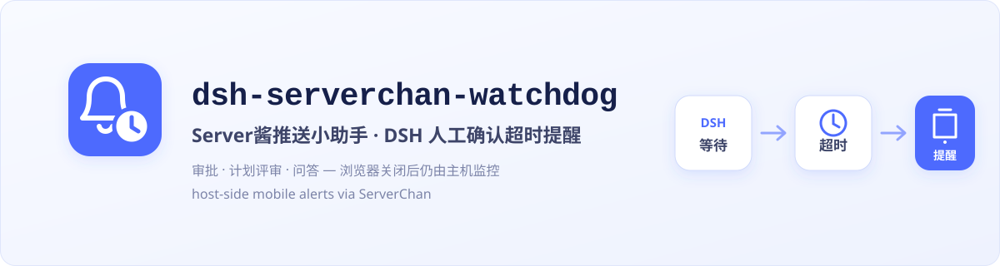

# dsh-serverchan-watchdog

**中文** · [English](./README.en.md)



[](https://github.com/MaRi23333/dsh-serverchan-watchdog/actions/workflows/ci.yml)


[](./LICENSE)


当 DeepSeek Harness（DSH）等待审批、计划评审或 `ask_user_question` 答复超过设定时间，本插件会从 DSH 主机端经 Server酱发送手机提醒；无需保持浏览器页面打开。

> `dsh-serverchan-watchdog` 是社区独立开发的第三方插件，与 Server酱及 DeepSeek Harness 官方无隶属、赞助或背书关系；相关名称仅用于说明兼容对象。

## 它解决什么

浏览器内通知适合人在电脑前时即时提示；本插件负责主机端计时，在你离开电脑、标签页已经关闭时继续监控，并在等待超过阈值后提醒手机。两类通知可以并用。

- **主机端监控**：监听持久会话事件流，不依赖浏览器连接。
- **三类原生等待**：问答、计划评审、工具审批/沙箱升级。
- **重启恢复**：DSH 重启后从会话日志重新挂起尚未闭合的等待，并保留原开始时间。
- **克制的失败处理**：网络错误、超时或 HTTP 5xx 最多重试两次；HTTP 4xx（含 429）、Server酱业务错误和异常响应立即停止，避免失控消耗额度。
- **本机加密存储**：SendKey 以 AES-256-GCM 密文保存，不进入仓库、日志或 API 响应。

## 监控哪些等待

| 场景 | 开始 | 结束 |
| --- | --- | --- |
| `ask_user_question` 问答 | 对应 `tool/call` | 匹配 `callId` 的 `tool/result` |
| `exit_plan_mode` 计划评审 | 对应 `tool/call` | 匹配 `callId` 的 `tool/result` |
| 工具审批 / 沙箱升级 | `approval/asked` | 匹配 ID 的 `approval/decided` |

默认等待 5 分钟后提醒一次。可以设置重复提醒间隔；一次推送失败只会在仍待处理时执行有界重试。尚未配置凭据时只延后检查，不会发出网络请求，也不消耗重试预算。

## 安装

推荐固定到已审核的 annotated `v0.1.0`：

```powershell
dsh plugin --profile web add github:MaRi23333/dsh-serverchan-watchdog#v0.1.0

# PATH 中没有 dsh 时
npx -p @deepseek-ai/dsh dsh plugin --profile web add github:MaRi23333/dsh-serverchan-watchdog#v0.1.0
```

需要主动跟随后续 `main` 时，可使用滚动安装；它不具备固定版本的可复现性：

```powershell
dsh plugin --profile web add github:MaRi23333/dsh-serverchan-watchdog
```

本地开发目录也可直接安装：

```powershell
dsh plugin --profile web add E:\path\to\dsh-serverchan-watchdog
```

安装后请从普通终端重启 `dsh web`。

## 配置

重启后打开 DSH 设置页 → 插件 → **Server酱推送小助手**。

- **推送地址 / SendKey**：支持经典 `SCT...`、Server酱³ `sctp...`，或控制台给出的官方完整 HTTPS 推送地址。
  - `SCT...` 对应 Server酱 Turbo，通常推送到微信。
  - `sctp...` 对应 Server酱³，推送到 Server酱³ App。
- **阈值**：默认 5 分钟；修改只影响之后新开始的等待。
- **重复提醒间隔**：默认 0，即成功送达一次后不重复。
- **网络代理**：可选 HTTP/HTTPS 代理；不接受 URL 中的用户名或密码。
- **打开 Harness 的链接**：默认 `http://127.0.0.1:3080`。手机上的 `127.0.0.1` 指向手机自身；需要从手机访问时应使用受保护的局域网/VPN 地址。
- **测试推送**：使用当前设置发送一条测试消息。

设置页保存值优先于 bundle patch。可用的默认配置如下：

```yaml
- id: serverchan-watchdog
  config:
    enabled: true
    thresholdMinutes: 5
    repeatMinutes: 0
    title: DSH 等待人工确认
    webUrl: http://127.0.0.1:3080
    proxy: ''
```

也可通过环境变量 `DSH_SERVERCHAN_SENDKEY` 注入凭据；它适合已有外部凭据管理的环境。不要把真实值写进仓库或命令输出。

## 数据流与安全

推送正文会把以下信息发送给 Server酱：交互类型、会话 ID、问题/计划/审批摘要、等待时长和配置的 Harness 链接。这些内容会离开本机，并受 Server酱渠道与账号的消息保留策略约束；不要在待确认文本或链接中放入密钥等敏感信息。

- SendKey 保存在 `$DSH_HOME/serverchan-watchdog/state.json`，加密密钥为同目录 `key.bin`。两者会尽力收紧文件权限，但能同时读取这两个文件的本机账户仍可恢复 SendKey；这不是系统凭据库。
- 只接受 Server酱官方 HTTPS 端点，拒绝带 userinfo、query、fragment、错误主机、错误路径或 UID 不匹配的地址。
- 配置、状态和测试接口只接受本机回环请求；同机不受信进程仍可能读取待处理摘要、修改设置或触发测试消息。不要直接把 DSH 暴露到公网，反向代理、LAN/VPN 场景应在外层配置认证和访问控制。
- 失败日志只保留 `timeout`、`network-failed`、HTTP 状态或业务错误类别，不记录 SendKey、完整 URL、响应正文或原始异常。
- Server酱额度、失败计费和消息保留期限随渠道及套餐而异，请以官方[发送说明](https://sct.ftqq.com/docs/getting-started/sendkey/)和[常见问题](https://sct.ftqq.com/docs/getting-started/faq/)为准。

## 本机接口

| 接口 | 方法 | 说明 |
| --- | --- | --- |
| `/serverchan-watchdog/status` | GET | 生效配置摘要与当前等待列表，不含凭据和状态目录路径 |
| `/serverchan-watchdog/config` | GET | 可编辑设置视图，不含凭据 |
| `/serverchan-watchdog/config` | POST | 保存 SendKey、阈值、重复间隔、代理或链接 |
| `/serverchan-watchdog/test` | POST | 发送一条测试推送 |

写接口要求 JSON 及回环同源校验。

## 已知限制

- 如果主机在人工已答复但结果尚未写入会话日志的极短窗口内崩溃，重启恢复可能多提醒一次。
- 推送前会重新确认该交互仍在等待，但无法撤销已经发出的 HTTP 请求。
- 手机提醒只是入口；能否从手机打开 Harness 取决于你配置的地址和网络访问控制。

## 开发

```powershell
pnpm install --frozen-lockfile
pnpm run typecheck
pnpm test
pnpm run build
pnpm run check:smoke
pnpm run check:pack
git diff --exit-code -- lib
```

CI 在 Node.js 22/24 上执行同等门禁。项目使用 `autoInstallPeers:false`，确保运行时依赖不会被本机自动补齐行为掩盖。

## License

[MIT](./LICENSE)
